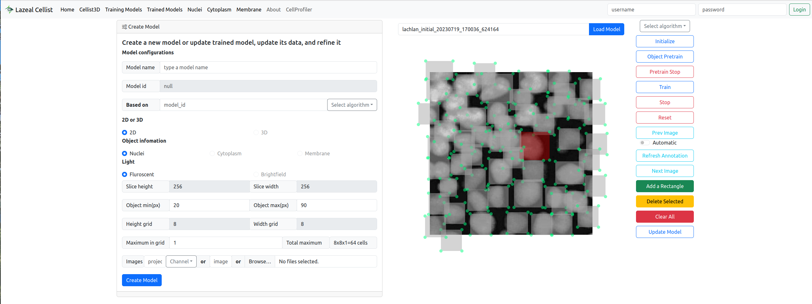

  

# Lazeal Cellist

## Lazeal Cellist: Your Efficient 3D Cell Detection and Profiling Platform

Welcome to Lazeal Cellist, a comprehensive and efficient cell detection, segmentation, and profiling platform for 3D microscopy images.

Our platform is designed to detect cells using unsupervised learning, thresholding techniques, and state-of-the-art algorithms such as Cellpose. Lazeal Cellist also provides an intuitive, interactive interface that allows users to refine detection results. These refined results are then fed back into the semi-supervised learning network, continuously improving our model's performance.

Lazeal Cellist stands out by offering an efficient 3D model that requires minimal effort to train and refine, making it a game-changer for scientists, researchers, and hobbyists.

### Key Features

- **Unsupervised 3D Cell Detection**: Identify cells in 3D microscopy images using advanced machine learning techniques.
- **Interactive Result Refinement Interface**: Refine the detection results with an intuitive, user-friendly interface.
- **Efficient Semi-Supervised Learning Network**: Enhance the model's performance over time with your refined results.
- **Cell Segmentation and Profiling**: Go beyond detection with advanced segmentation and profiling capabilities.

### Inspired by Research

Lazeal Cellist is inspired by cutting-edge research in the field of deep learning, including:

1. "Attend, Infer, Repeat: Fast Scene Understanding with Generative Models"
2. "Spatially Invariant Attend, Infer, Repeat"
3. "Faster Attend-Infer-Repeat with Tractable Probabilistic Models"

These works provide valuable insights that have guided the development of our platform's algorithms and methodologies.

(Note: For accurate citation, please refer directly to the original papers.)

### Contribute to Lazeal Cellist

Lazeal Cellist is an open-source project, and we welcome contributions from everyone, regardless of your level of experience. We invite contributions that:

- Enhance algorithmic efficiency and performance
- Improve the user interface and user experience
- Expand our documentation and examples
- Fix bugs and enhance system stability

Before you start contributing, please first discuss the change you wish to make via an issue. This helps us coordinate our efforts and avoid duplicating work or addressing issues that are already in progress.

For more information on how to get started, please read our contributing guidelines.

### License

This project is licensed under the MIT License. For more information, please refer to the [LICENSE](https://chat.openai.com/LICENSE) file in this repository.
