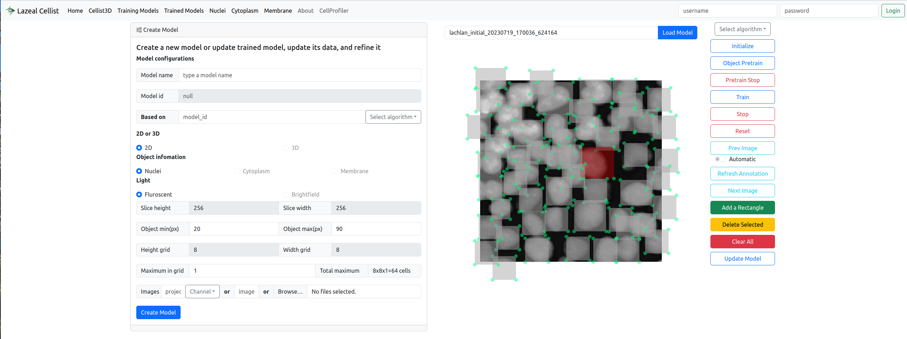

[English](README.md) · [العربية](i18n/README.ar.md) · [Español](i18n/README.es.md) · [Français](i18n/README.fr.md) · [日本語](i18n/README.ja.md) · [한국어](i18n/README.ko.md) · [Tiếng Việt](i18n/README.vi.md) · [中文 (简体)](i18n/README.zh-Hans.md) · [中文（繁體）](i18n/README.zh-Hant.md) · [Deutsch](i18n/README.de.md) · [Русский](i18n/README.ru.md)


[](https://github.com/lachlanchen/lachlanchen/blob/main/figs/banner.png)

<h1 align="center">Lazeal Cellist</h1>

<p align="center">
  <strong>Your Efficient 3D Cell Detection and Profiling Platform</strong>
</p>

<p align="center">
  
  
  
  
  
  
  
</p>

<p align="center">
  <a href="#-overview"></a>
  <a href="#-installation"></a>
  <a href="#-usage"></a>
  <a href="#-troubleshooting"></a>
  <a href="#-contributing"></a>
</p>

## 🎬 Preview



## Lazeal Cellist: Your Efficient 3D Cell Detection and Profiling Platform

Welcome to Lazeal Cellist, a comprehensive and efficient cell detection, segmentation, and profiling platform for 3D microscopy images.

Our platform is designed to detect cells using unsupervised learning, thresholding techniques, and state-of-the-art algorithms such as Cellpose. Lazeal Cellist also provides an intuitive, interactive interface that allows users to refine detection results. These refined results are then fed back into the semi-supervised learning network, continuously improving model performance.

Lazeal Cellist stands out by offering an efficient 3D model that requires minimal effort to train and refine, making it a practical platform for scientists, researchers, and hobbyists.

> ℹ️ **Scope note**
> The project vision and UI include 3D concepts (`/3d`, `templates/cellist_3d.html`), while the current primary training flow in code is mainly 2D slicing + refinement.

---

## Table of Contents

- [Overview](#-overview)
- [Key Features](#-key-features)
- [Project Structure](#-project-structure)
- [Prerequisites](#-prerequisites)
- [Installation](#-installation)
- [Usage](#-usage)
- [Configuration](#-configuration)
- [Examples](#-examples)
- [Inspired by Research](#-inspired-by-research)
- [Development Notes](#-development-notes)
- [Troubleshooting](#-troubleshooting)
- [Roadmap](#-roadmap)
- [Contributing](#-contributing)
- [Acknowledgements](#-acknowledgements)
- [Support](#-support)
- [License](#-license)

## 🔍 Overview

Lazeal Cellist is a Python/Tornado web platform for microscopy-image workflows with:

- Browser-based upload, model creation, and annotation editing.
- Algorithm-assisted initialization (Cellpose nuclei mode).
- Iterative human-in-the-loop refinement via WebSocket actions (`create`, `initialize`, `pretrain`, `pretrain-stop`, `train`, `train-stop`, `update`, `reset`).
- Database-backed persistence for models, image slices, and annotations.

> ℹ️ Note on current behavior: although the project vision and UI include 3D concepts (`/3d`, `templates/cellist_3d.html`), the current main training flow in code is primarily 2D slicing + model refinement.

### Quick At-a-Glance

| Area | Current implementation |
|---|---|
| Server | Tornado (`app.py`) |
| Port | `8887` |
| Database | MySQL (`cellist.sql`) |
| Core ML stack | PyTorch + Pyro + Cellpose |
| Frontend | Bootstrap, jQuery, jQuery UI, Three.js, blueimp-file-upload |
| Inference init | Cellpose (`model_type='nuclei'`, `gpu=True`) |
| Packaging status | Research prototype (no `pyproject.toml`/`setup.py`) |
| Tests/CI status | No dedicated automated test suite or CI config in repository root |

### Documentation Languages

This repository already includes multilingual README files under `i18n/`:

| Language | File |
|---|---|
| Arabic | `README.ar.md` |
| German | `README.de.md` |
| Spanish | `README.es.md` |
| French | `README.fr.md` |
| Japanese | `README.ja.md` |
| Korean | `README.ko.md` |
| Russian | `README.ru.md` |
| Vietnamese | `README.vi.md` |
| Chinese (Simplified) | `README.zh-Hans.md` |
| Chinese (Traditional) | `README.zh-Hant.md` |

## ✨ Key Features

- **Unsupervised 3D Cell Detection**: Identify cells in 3D microscopy images using advanced machine learning techniques.
- **Interactive Result Refinement Interface**: Refine detection results with an intuitive, user-friendly interface.
- **Efficient Semi-Supervised Learning Network**: Enhance model performance over time with refined results.
- **Cell Segmentation and Profiling**: Go beyond detection with advanced segmentation and profiling capabilities.

Additional implementation features currently present:

- Tornado REST + WebSocket server (`app.py`) on port `8887`.
- Automatic image tiling (`256x256` by default) for model ingestion.
- MySQL schema included as dump: [`cellist.sql`](cellist.sql).
- Frontend stack includes Bootstrap, jQuery, jQuery UI, Three.js, blueimp-file-upload.
- Asynchronous model tasks through a thread pool (`max_workers=64`).

## 🗂️ Project Structure

```text
cellist/
├── app.py                               # Main Tornado server + REST/WebSocket handlers
├── cellist/                             # Core ML/model code
│   ├── model_init.py                    # Main 2D model class and train flow
│   ├── model_pretrain.py                # Pretrain variant
│   ├── model_2d_components.py           # Encoder/Decoder/SPAIR components
│   ├── model_2d_utilities.py            # DB-backed model metadata + transforms
│   ├── image_preprocessing.py           # Slice/stitch helpers
│   └── utils/constants.py               # Runtime paths + MySQL config
├── templates/
│   ├── cellist.html                     # Primary 2D UI
│   └── cellist_3d.html                  # 3D UI variant/prototype
├── statics/                             # Frontend assets and npm dependencies
│   ├── package.json
│   └── node_modules/
├── i18n/                                # Translated README files
├── notebooks/                           # Exploratory notebooks
├── polygon_sample/                      # Polygon annotation experiments
├── figs/                                # Branding assets
├── cellist.sql                          # MySQL schema/data dump
├── cellist.yaml                         # Conda environment specification
├── create_data_folder.py                # Legacy data-folder creation helper
├── CONTRIBUTING.md
├── PULL_REQUEST_TEMPLATE.md
├── LazealCellist Documentation.md       # Extended architecture/TODO notes
└── README.md
```

## ✅ Prerequisites

| Requirement | Notes |
|---|---|
| OS | Linux recommended (commands below assume Linux shell behavior). |
| Python/Conda | Conda available to create environment from [`cellist.yaml`](cellist.yaml). |
| Database | MySQL server running on `localhost` with database `cellist`. |
| GPU | NVIDIA/CUDA environment strongly recommended/expected by current code paths. |
| Node.js + npm | Required to install `statics/node_modules` frontend dependencies. |
| Disk write access | Needed for runtime data under `<repo>/data`. |

## 🛠️ Installation

### 1. Clone and enter repository

```bash
git clone <your-fork-or-upstream-url>
cd cellist
```

### 2. Create Python environment

Use the repository file name `cellist.yaml`:

```bash
conda env create -f cellist.yaml
conda activate cellist
```

Compatibility note preserved from older docs: previous documentation used `celist.yaml` (missing an `l`), but the file in this repository is `cellist.yaml`.

Legacy command (preserved):

```bash
conda env create -f celist.yaml
```

### 3. Install frontend dependencies

```bash
cd statics
npm install
cd ..
```

### 4. Prepare runtime data directories

The app expects a `data/` tree (and `.gitignore` already excludes `data`).

```bash
mkdir -p data/{annotation_algorithm,annotation_manual,cropped,dataset,images,models,models_backup,temp,uploads}
```

Note: [`create_data_folder.py`](create_data_folder.py) exists, but it currently creates directories in the current working directory (not under `data/`). Keep this in mind if you use it.

### 5. Prepare MySQL authentication (if needed)

If root authentication is socket-based and blocks app access, older project docs suggest switching to password auth:

```bash
sudo mysql
```

```sql
SELECT user,authentication_string,plugin,host FROM mysql.user;
ALTER USER 'root'@'localhost' IDENTIFIED WITH mysql_native_password BY 'yourpassword';
FLUSH PRIVILEGES;
EXIT;
```

### 6. Create database and restore schema/data

```bash
mysql -u root -p -e "CREATE DATABASE IF NOT EXISTS cellist;"
mysql -u root -p cellist < cellist.sql
```

Legacy documentation example (preserved):

```sql
mysql -u root -p cellist < /home/user/cellist.sql
```

### 7. Configure MySQL credentials for runtime

Current code reads credentials from [`cellist/utils/constants.py`](cellist/utils/constants.py) (`mysqlconfig` and `mysqlurl`).

Default code values currently include:

- host: `localhost`
- user: `root`
- password: `lazeal0626`

For local security, update these values before running in your environment.

### 8. Optional environment sanity checks

```bash
python -V
python -c "import torch, pyro, tornado, pymysql; print('core imports OK')"
node -v
npm -v
```

## 🚀 Usage

### Start the web server

```bash
python app.py
```

Legacy startup command from prior docs (preserved):

```bash
python app.py -m cellist
```

Server route defaults observed in code:

- Main UI: `http://localhost:8887/`
- 3D page: `http://localhost:8887/3d`

### Typical workflow

1. Open the UI and log in.
2. Upload microscopy images from the Create Model panel.
3. Choose base algorithm (`Cellpose`) and create model.
4. Let backend slice images and initialize detections.
5. Load cropped images, review/adjust rectangle annotations.
6. Run `initialize`, `pretrain`, and `train` cycles.
7. Use `Pretrain Stop` / `Stop` (`train-stop`) / `reset` as needed.
8. Persist manual updates via `Update Model`/annotation actions.

### Built-in UI login credentials (current template behavior)

The frontend currently checks these static credentials client-side:

- `admin` / `admin`
- `lachlan` / `lachlan`
- `yanjun` / `yanjun`

This is prototype behavior and not production authentication.

### API/Socket surface currently used by the UI

HTTP endpoints:

- `GET /`
- `GET /3d`
- `POST /upload/<ws_uuid>`
- `POST /load_model/<ws_uuid>`

WebSocket endpoint:

- `ws://localhost:8887/websocket/<ws_uuid>`

Recognized `data_type` action messages in WebSocket handler:

- `create`
- `update`
- `initialize`
- `pretrain`
- `pretrain-stop`
- `train`
- `train-stop`
- `reset`

## ⚙️ Configuration

### Backend and endpoints

Configured in [`app.py`](app.py):

- Port: `8887`
- Routes:
  - `/`
  - `/3d`
  - `/upload/(.*)`
  - `/load_model/.*`
  - `/websocket/(.*)`

### Model/data behavior

- Thread pool size is `max_workers=64`.
- Image tiles are `256x256` by default.
- Cellpose initialization uses `model_type='nuclei'` and `gpu=True`.
- Training and pretraining run asynchronously through WebSocket-triggered actions.
- Data root is resolved from current working directory as `<repo>/data`.

### Database/runtime constants

From [`cellist/utils/constants.py`](cellist/utils/constants.py):

- `dataroot = os.path.join(curdir, "data")`
- `mysqlconfig` includes host/user/password keys
- `mysqlurl` targets database name `cellist`

### Frontend dependency snapshot

From [`statics/package.json`](statics/package.json):

- `bootstrap`
- `bootstrap-icons`
- `jquery`
- `jquery-ui` / `jquery-ui-dist`
- `three`
- `blueimp-file-upload`

### Conda environment highlights

From [`cellist.yaml`](cellist.yaml):

- Python `3.8.12`
- PyTorch `1.12.0`
- CUDA toolkit `11.3.1`
- Tornado `6.1`
- Cellpose `0.7.2` (pip)
- Pyro (`pyro-ppl==1.8.1`)
- PyMySQL + SQLAlchemy

## 🧪 Examples

### Example: WebSocket create message shape

```json
{
  "data_type": "create",
  "arguments": {
    "username": "lachlan",
    "model_name": "experiment_001",
    "based_on_algorithm": "Cellpose",
    "local_images_uuid": ["<image_uuid_1>", "<image_uuid_2>"],
    "slice_height": 256,
    "slice_width": 256
  }
}
```

### Example: WebSocket manual annotation update

```json
{
  "data_type": "update",
  "username": "lachlan",
  "model_id": "<model_id>",
  "image_uuid": "<cropped_id>",
  "z_where": [[0.1, 0.1, 0.2, -0.1]]
}
```

### Example: Model load request

```bash
curl -X POST http://localhost:8887/load_model/any \
  -d "model_id=<model_id>" \
  -d "cursor=0"
```

### Example: minimal end-to-end local start

```bash
conda env create -f cellist.yaml
conda activate cellist
cd statics && npm install && cd ..
mkdir -p data/{annotation_algorithm,annotation_manual,cropped,dataset,images,models,models_backup,temp,uploads}
mysql -u root -p -e "CREATE DATABASE IF NOT EXISTS cellist;"
mysql -u root -p cellist < cellist.sql
python app.py
```

## 📚 Inspired by Research

Lazeal Cellist is inspired by cutting-edge research in deep learning, including:

1. "Attend, Infer, Repeat: Fast Scene Understanding with Generative Models"
2. "Spatially Invariant Attend, Infer, Repeat"
3. "Faster Attend-Infer-Repeat with Tractable Probabilistic Models"

These works provide valuable insights that have guided the development of our platform's algorithms and methodologies.

(Note: For accurate citation, please refer directly to the original papers.)

## 🧭 Development Notes

- Core model classes are under `cellist/` (`ModelD2Init`, `ModelD2Pretrain`).
- Main interactive UI logic is embedded directly in `templates/cellist.html`.
- SQL schema and seed-style data are in `cellist.sql`.
- Notebooks in `notebooks/` and `polygon_sample/` provide exploratory references.
- Extended platform/model notes are in [`LazealCellist Documentation.md`](LazealCellist%20Documentation.md).
- There is currently no dedicated automated test suite or CI configuration in the repository root.

### Assumptions and current constraints

- This repository appears to target local, research-oriented use first.
- Some code paths assume GPU (`cuda:0`) availability.
- Authentication and secret management are prototype-level.
- 3D interfaces exist, but the dominant training workflow remains 2D tile-oriented.

## 🧯 Troubleshooting

| Symptom | Suggested checks |
|---|---|
| `ModuleNotFoundError` or import issues | Confirm `conda activate cellist` was applied before running `python app.py`. |
| UI renders without styling/scripts | Run `npm install` inside `statics/` and confirm `statics/node_modules` exists. |
| MySQL access denied | Verify username/password in `cellist/utils/constants.py` and MySQL plugin/auth mode. |
| App starts but model actions fail | Check CUDA/GPU availability; current paths assume CUDA (`torch.device('cuda:0')`, Cellpose `gpu=True`). |
| Upload succeeds but no tiles/models appear | Ensure `data/` subdirectories exist and are writable. |
| REST/WebSocket request errors | Confirm server is running on `http://localhost:8887` and request payload keys match current template names. |
| `FileNotFoundError` under `data/` | Start the app from repository root so relative paths resolve consistently. |

### Quick diagnostics

```bash
# Verify Python environment and key imports
python -c "import torch, pyro, tornado, pymysql; print('imports ok')"

# Confirm server port is open after startup
ss -ltnp | rg 8887

# Check MySQL connectivity
mysql -u root -p -e "SHOW DATABASES LIKE 'cellist';"
```

## 🛣️ Roadmap

The following items are preserved and organized from existing project documentation/TODO notes:

- Polygon sample: use polygon instead of rectangle annotation.
- Optimize model for `float32` behavior with very small/large values.
- Shrink model size where possible.
- Improve robustness with approaches such as Transformer/stable-diffusion-inspired components.
- Add base-model options (Threshold, Cellpose) and target-model options (AIR, Transformer, SD).
- Interface optimization (including multiple selection).
- Backend optimization (including improved memory/cache handling).
- Easy-to-use packaging with minimal DB configuration (e.g., SQLite option).

## 🤝 Contributing

### Contribute to Lazeal Cellist

Lazeal Cellist is an open-source project, and we welcome contributions from everyone, regardless of experience level. We invite contributions that:

- Enhance algorithmic efficiency and performance
- Improve the user interface and user experience
- Expand documentation and examples
- Fix bugs and enhance system stability

Before you start contributing, please first discuss the change you wish to make via an issue. This helps coordinate efforts and avoid duplicate or conflicting work.

For more information on how to get started, please read the contributing guidelines.

Additional repository contribution docs:

- [Contribution Guidelines](CONTRIBUTING.md)
- [Pull Request Template](PULL_REQUEST_TEMPLATE.md)

## 🙏 Acknowledgements

- The Lazeal Cellist concept and implementation draw heavily from the AIR/SPAIR line of research listed above.
- The repository includes historical/legacy documentation and commands intentionally preserved for continuity with prior project usage.

## ❤️ Support

| Donate | PayPal | Stripe |
| --- | --- | --- |
| [](https://chat.lazying.art/donate) | [](https://paypal.me/RongzhouChen) | [](https://buy.stripe.com/aFadR8gIaflgfQV6T4fw400) |

## 📄 License

This project is licensed under the MIT License. For more information, please refer to the [LICENSE](LICENSE) file in this repository.

Repository status note: no root `LICENSE` file is currently present in this checkout. The line above is preserved from the prior README as canonical project intent; add a local `LICENSE` file in a follow-up change if desired.
